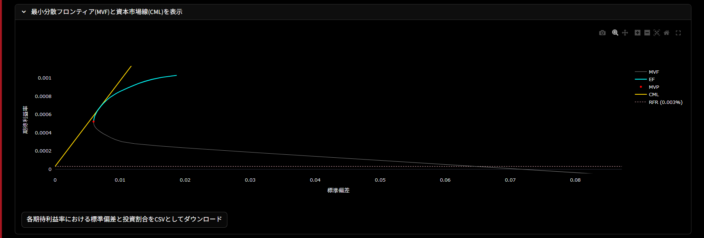
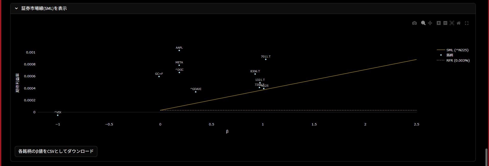
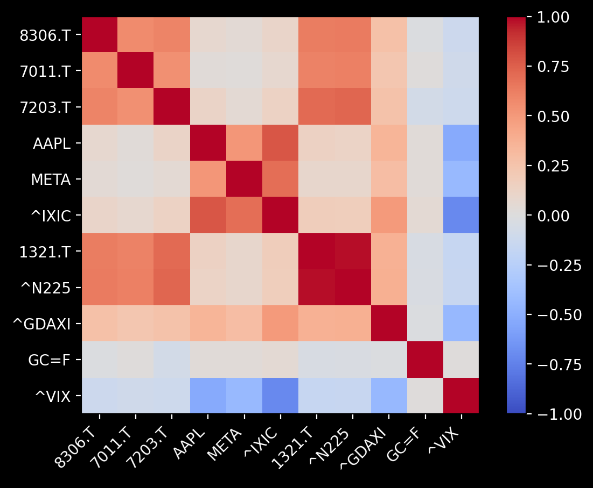

# Minimum Variance Frontier Calculator / 最小分散フロンティア計算アプリ

[English](#english) | [日本語](#japanese)

---

## English

A Streamlit application for calculating and visualizing the Minimum Variance Frontier (MVF), Capital Market Line (CML), and Security Market Line (SML) based on Modern Portfolio Theory.

### Features

- **Ticker Search**: Add securities by ticker code or company name (supports Japanese and US stocks)
- **CSV Import**: Bulk import price data via CSV file
- **Log Return Analysis**: Calculate mean returns and standard deviations using log returns
- **Constrained Optimization**: Create MVF with minimum weight constraints
- **CSV Export**: Export expected returns, standard deviations, and portfolio weights

### Screenshots

### CSV Format

| | 2025-04-01 | 2025-04-02 | 2025-04-03 |
|-----|------------|------------|------------|
| 7203.T | 2350 | 2360 | 2370 |
| 6758.T | 10500 | 10600 | 10700 |
| AAPL | 180.5 | 181.2 | 182.0 |

- **Rows**: Ticker codes (alphanumeric)
- **Columns**: Dates (YYYY-MM-DD format)

### Data Sources

- **Stock Prices**: [Yahoo Finance](https://finance.yahoo.com/)
- **Risk-Free Rate**: [Ministry of Finance Japan](https://www.mof.go.jp/jgbs/reference/interest_rate/)
- **Japanese Stock List**: [Japan Exchange Group](https://www.jpx.co.jp/)

### Live Demo

https://minvarfrontierapp-bg8btma7pxcm5daqspe2oc.streamlit.app/

---

## 日本語

ポートフォリオ理論に基づいた最小分散フロンティア（MVF），資本市場線（CML），証券市場線（SML）を計算・可視化するStreamlitアプリです．

### 主な機能

- **銘柄検索**: 証券コード・銘柄名による銘柄追加（日本株・米国株対応）
- **CSVインポート**: CSVファイルによるデータの一括読み込み
- **ログリターン分析**: ログリターンを用いた平均・標準偏差の計算
- **制約付き最適化**: 投資割合に制約を加えた最小分散フロンティアの作成
- **CSV出力**: 期待利益率，標準偏差，投資割合をCSVとして出力可能

### スクリーンショット

### CSV形式

| | 2025-04-01 | 2025-04-02 | 2025-04-03 |
|-----|------------|------------|------------|
| 7203.T | 2350 | 2360 | 2370 |
| 6758.T | 10500 | 10600 | 10700 |
| AAPL | 180.5 | 181.2 | 182.0 |

- **行**: 証券コード（半角英数）
- **列**: 日付（YYYY-MM-DD形式）

### データソース

- **株価データ**: [Yahoo Finance](https://finance.yahoo.com/)
- **無リスク金利**: [財務省](https://www.mof.go.jp/jgbs/reference/interest_rate/)
- **日本株リスト**: [日本取引所グループ](https://www.jpx.co.jp/)

### デプロイ先（Streamlit Cloud）

https://minvarfrontierapp-bg8btma7pxcm5daqspe2oc.streamlit.app/

---

## License / ライセンス

MIT License

## Author / 作成者

- GitHub: https://github.com/MA22-1144F

## Disclaimer / 免責事項

**English**: This app is created for educational purposes and is not intended for investment decisions. The developer assumes no responsibility for any damages arising from the use of this app.

**日本語**: 本アプリは学習目的で作成されたものであり，投資判断への利用を想定したものではありません．本アプリの利用によって生じたいかなる損害についても開発者は責任を負いかねます．
